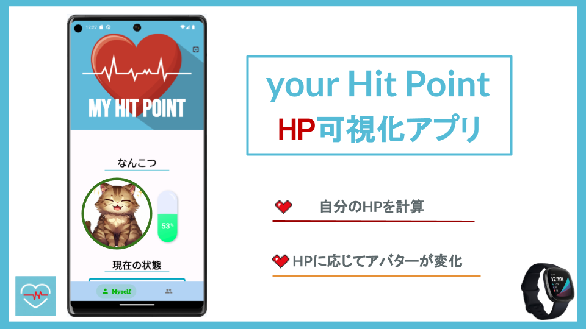
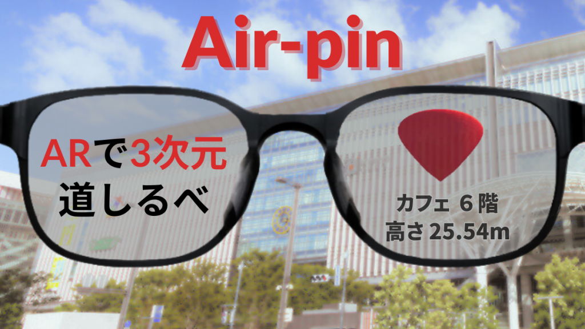
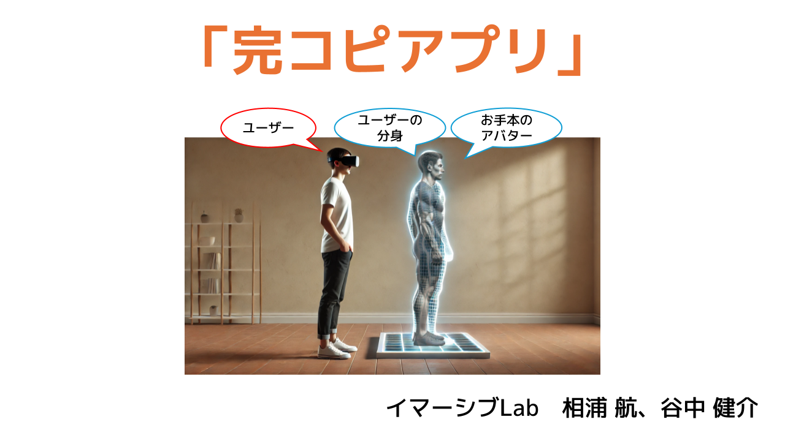
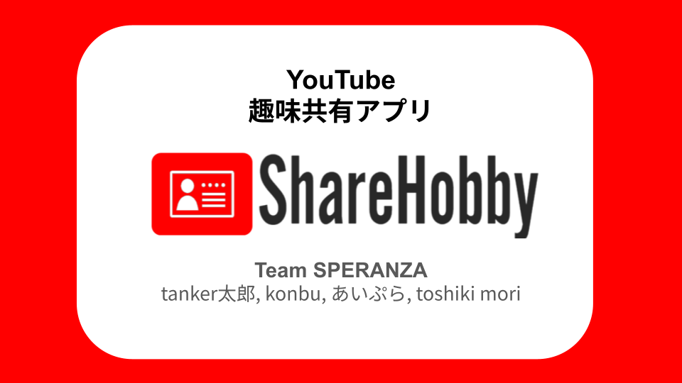
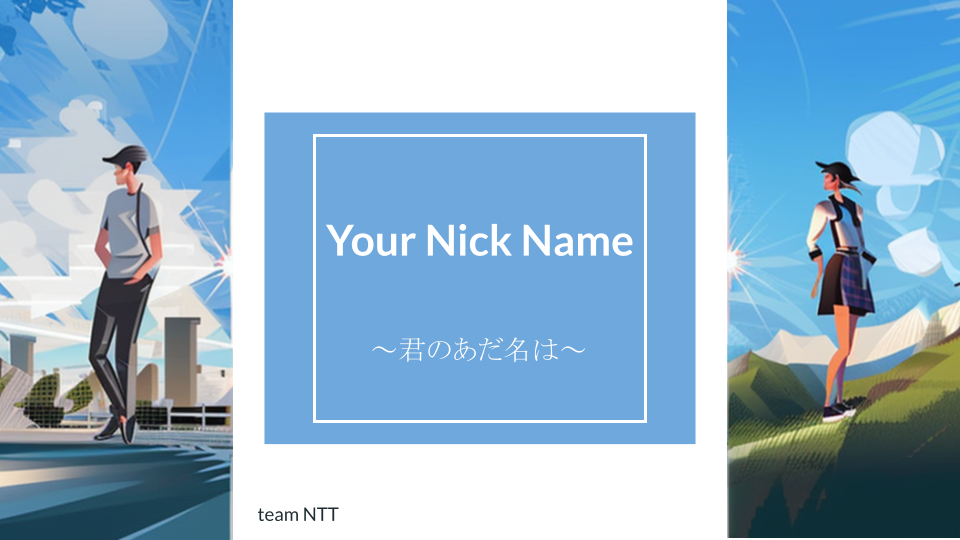

## 概要

研究活動と並行して、生活を楽しくするヘルスケアアプリや、AR/VRを用いた新しいインタラクション体験、日常のコミュニケーションを促進するWebアプリケーションなどの開発を行っています。ハッカソンやコンテストにも積極的に参加し、アイデアを形にする実装力とチーム開発を重視しています。

---

## アプリ

### your hit point

**概要:** スマートウォッチ（Fitbit）を用いて睡眠時間や心拍、歩数などの身体情報を取得し、ユーザーの「体力（HP）」を可視化するアプリです。HPはアプリ内のペットの状態と連動しており、ペットを愛でる気持ちが自身の健康維持に繋がります。（現在、改良版「Your Magic Point」を作成中）

**担当役割:** バックエンド / アプリデザイン / マネジメント

**使用技術:**
- Python / Flutter
- Firebase
- Android Studio / Fitbit API

**リンク:**
- [Protopedia](https://protopedia.net/prototype/4604)

---

### Air-Pin

**概要:** ARグラス上で目的地の場所を3次元的な情報を含めて表示するアプリです。Google Mapsのような既存の2次元ピンとは異なり、高さ情報を含めて目的地の階層に合わせた3次元のピンをAR空間上に投影します。

**担当役割:** AR部開発

**使用技術:**
- Unity / Python
- Cloud Run / Geospatial API
- XREAL Air / PLATEAU

**リンク:**
- [Protopedia](https://protopedia.net/prototype/5094)

---

### 完コピアプリ（イマーシブLab）

**概要:** 自分の動きとお手本の動きのシンクロ具合を3人称視点から確認できるVRアプリです。DeepMotionを利用してお手本の動き（アニメーション）を作成し、それを元にVR空間での訓練環境のプロトタイプを構築しました。

**担当役割:** [役割をここに記入]

**使用技術:**
- Unity / Python
- DeepMotion
- Meta Quest 3 / フルトラッキングデバイス (Base station 2.0, Vive tracker 3.0)

**リンク:**
- [Protopedia](https://protopedia.net/prototype/6715)

---

### ShareHobby

**概要:** YouTubeの視聴履歴から、ユーザーがよく見ているチャンネルや動画データを元に趣味嗜好を反映した自己紹介カードを作成・共有できるWebサービスです。初対面の人との交流時などに、ゲームやアニメ、配信者の話題で盛り上がるきっかけを提供します。

**担当役割:** フロントエンド / デザイン

**使用技術:**
- Next.js / Ruby on Rails
- YouTube Data API
- ChatGPT API

**リンク:**
- [Protopedia](https://protopedia.net/prototype/5193)

---

### your nick name

**概要:** Slackに投稿されたメッセージ内容を解析し、メッセージを投稿したユーザーの「ニックネーム」を自動生成して出力するSlackBotです。「ChatGPTを用いて何か楽しいことがしたい」という思いから作成しました。

**担当役割:** [役割をここに記入]

**使用技術:**
- Python / Slack API
- ChatGPT API

**リンク:**
- [Protopedia](https://protopedia.net/prototype/5104)

---

## 実績

### 助成金・資金援助

| 年 | プログラム | 機関 |
|----|-----------|------|
| 2025 | [QRECアイデアバトル 2025 2nd](https://qrec.kyushu-u.ac.jp/news/idea-battle_20251109/) | 九州大学 |
| 2025 | [QRECアクセラレーションプログラム 2025夏](https://qrec.kyushu-u.ac.jp/news/acceleration-program_qsap03_adopters/) | 九州大学 |
| 2025 | [QRECアイデアバトル 2025 1st](https://qrec.kyushu-u.ac.jp/news/20250525_ib1st/) | 九州大学 |
| 2025 | [QRECアクセラレーションプログラム 2025春](https://qrec.kyushu-u.ac.jp/news/20251212_01/) | 九州大学 |
| 2023 | [福岡未踏的人材発掘・育成コンソーシアム 2023 Grow](https://mitou-fukuoka.org/works/air-pin/) | 福岡未踏的人材発掘・育成コンソーシアム |

### 受賞・採択（開発・プロダクト関連）

- **2025** [九州大学 QRECアクセラレーションプログラム 2025春](https://qrec.kyushu-u.ac.jp/news/20251212_01/) 採択（作品名：完コピアプリ）
- **2024** [福岡県ITスタートアップビジネス大賞2024](https://www.youtube.com/watch?v=cDuHPSLw_d8) 学生部門優秀賞, F Ventures賞（作品名：your hit point）
- **2023** [エンジニアフレンドリーシティ福岡 Engineer Driven Day 2023](https://protopedia.net/event/engineerdrivenday2023) プロダクト開発部門賞（作品名：your hit point）
- **2023** [九州チャレンジキャラバンコンテスト2023](https://challecara.org/?page_id=3082) 最優秀賞（作品名：your hit point）
- **2023** [福岡未踏的人材発掘・育成コンソーシアム2023 Grow](https://mitou-fukuoka.org/works/air-pin/) 採択（作品名：Air-pin）