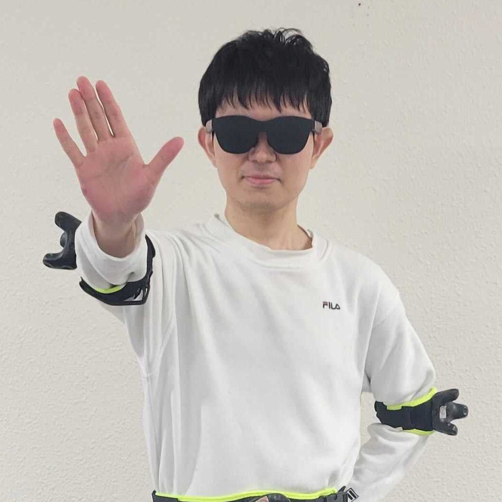

:::: {.columns}

::: {.column width="25%"}

:::

::: {.column width="75%"}
## 自己紹介

長崎県出身。九州大学工学部 電気情報工学科を卒業後、同大学院システム情報科学府 情報理工学専攻へ進学し、現在は博士後期課程1年に在籍しています（[人間情報システムグループ](https://app.ait.kyushu-u.ac.jp/)所属）。ヒューマンコンピュータインタラクション（HCI）やXR環境におけるユーザー行動分析を専門に研究する傍ら、ハッカソンやビジネスコンテストでのアプリケーション開発にも精力的に取り組んでいます。中高生時代に培ったVR酔いへの完全な耐性を活かし、長時間のXR開発や実験を苦としない点も強みです。
:::

::::

---

## 学歴

| 期間 | 学位・区分 | 大学・機関 |
|------|------|-----------|
| 2026年4月 ～ 現在 | 博士後期課程 在学 | 九州大学 大学院システム情報科学府 情報理工学専攻 |
| 2024年4月 ～ 2026年3月 | 修士（工学） | 九州大学 大学院システム情報科学府 情報理工学専攻 |
| 2020年4月 ～ 2024年3月 | 学士（工学） | 九州大学 工学部 電気情報工学科 |

---

## その他の業績・活動

### 採択・フェローシップ

* **[次世代研究者挑戦的研究プログラム（K²-SPRING）](https://k-spring.kyushu-u.ac.jp/)**: 令和8年度（博士課程）合格内定（2025年9月）
* **[kboost]**: 令和8年度（博士課程）合格

### 研究・教育補助業務（RA / TA等）

* 九州大学人間情報システム研究グループ「高校生向け学科診断チャットボットiTOChatの開発業務」補助（2024年6月）
* 九州大学人間情報システム研究グループ「ウェアラブルエキスポでの研究室出展」補助（2025年1月）

### 特記事項

* **VR・車酔い耐性**: 中高一貫校時代、毎日往復3時間半のバス通学を経験した結果、車酔いおよび「VR酔い」を全くしない体質を獲得。XR分野における長時間の実験や開発において強力なアドバンテージとなっています。
