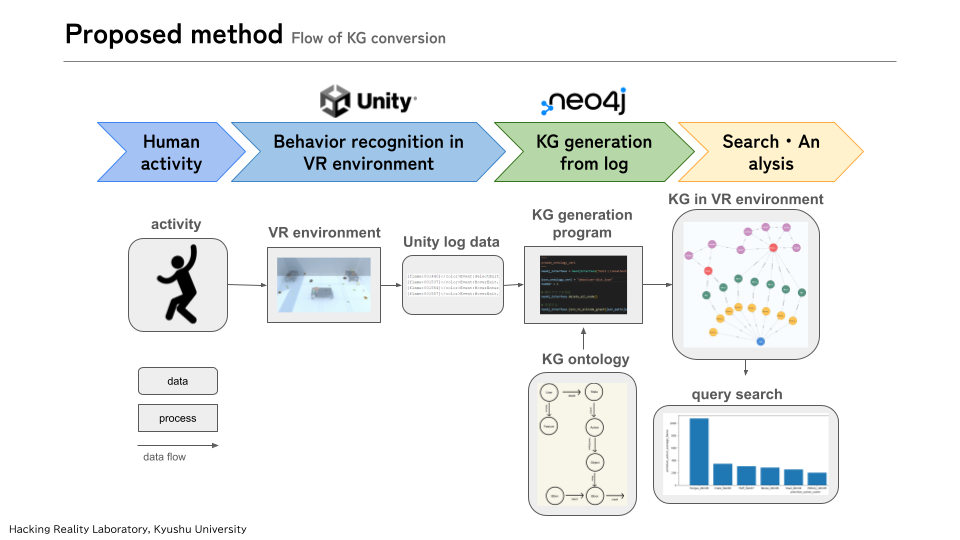
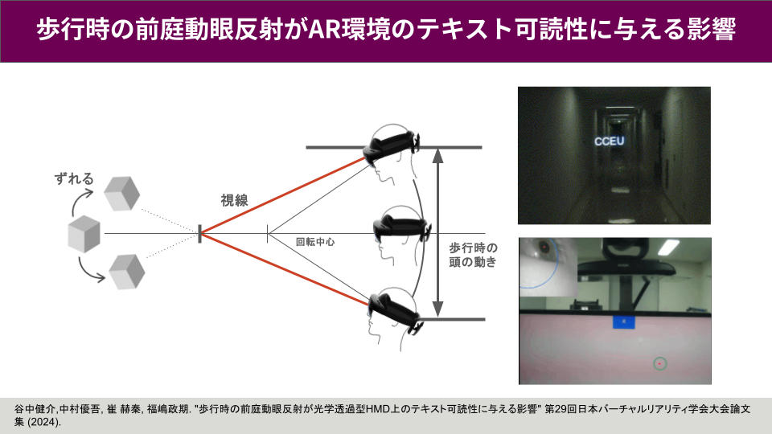
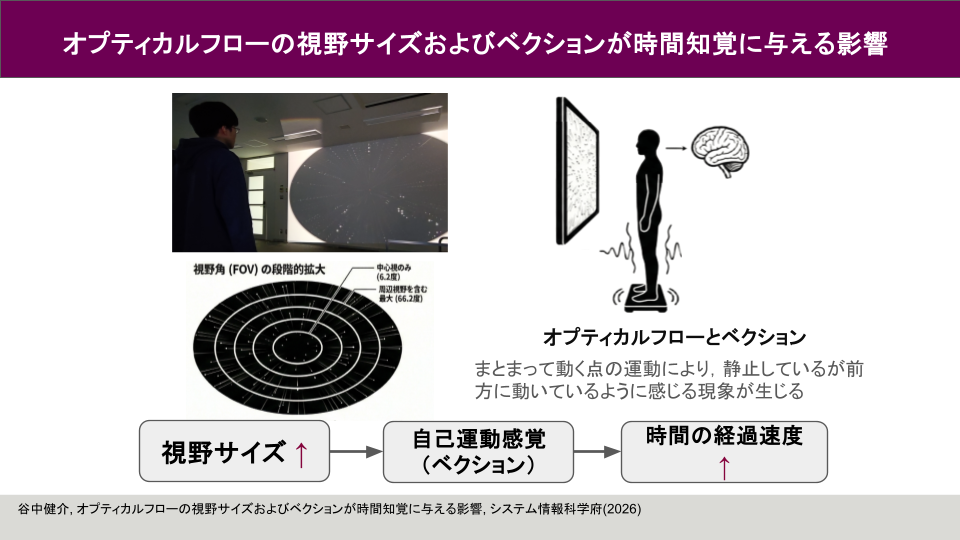

## 研究テーマ

ヒューマンコンピュータインタラクション（HCI）を専門とし、XR（VR/AR）環境におけるユーザー行動分析やインタラクション設計、およびオンラインコミュニケーションにおける孤立ユーザーの発見と支援に関する研究を行っています。

- **ユーザのインタラクションに基づく動的バーチャル学習空間の構築と学習評価**: VRでのユーザの行動を知識グラフ（KG）学習推薦と空間の動的再構成を行うシステムの構築を目的とします。具体的には、時空間データをKG化し、GNTによる3D物体生成やATOM理論を用いた学習提案を行います。これにより、個別に最適化された再帰的学習環境の提供と、行動変容等の定量的な学習評価を目指します。

  

- **歩行時の前庭動眼反射がAR環境のテキスト可読性に与える影響**: 歩行中の光学透過型HMDにおけるテキスト可読性への前庭動眼反射（VOR）の影響を調査しています。実世界では視界を安定させるVORですが、頭部と連動する画面固定テキストでは逆効果となり、可読性を下げる仮説を検証しました。実験の結果、歩行による頭部の揺れと視線の動きが連動することを確認し、提示深度が遠いほど視線のばらつきが抑制される傾向を明らかにしました。

  

- **オプティカルフローの視野サイズおよびベクションが時間知覚に与える影響**: VRにおける視野サイズと自己運動感覚（ベクション）時間知覚に与える影響を調査しています。実験では視野角を操作した視覚刺激を提示し、主観的ベクション、重心動揺、時間の経過感（PoTJ）と持続時間（DoTJ）を評価しました。結果、ベクション感受性が高い参加者では、視野拡大により経過感が加速し、姿勢制御の複雑性が増す一方、持続時間の推定には影響しないことが示されました。

  

- **組織コミュニケーションにおける孤立ユーザーの発見と可視化**: Slackなどの組織内チャットツールにおいて、貢献度や隣接度に基づくソーシャルグラフを用い、孤立ユーザーや非活性グループを早期に発見・支援する分析システムを開発しています。

---

## 論文

### 学術論文

1. Ryosuke Takizawa, Isshin Nakao, Kensuke Taninaka, et al., **Visualization of Online Communication and Detection of Lonely Users Using Social Graphs Based on Contribution Level and Adjacency Level**, *Journal of Information Processing*, vol. 33, pp. 765-775, 2025.

### 会議論文

1. Ryosuke Takizawa, Isshin Nakao, Kensuke Taninaka, et al., **Development of a Communication Analysis System for Detecting Isolated Users in Slack**, *Proceedings of the 16th IIAI International Congress on Advanced Applied Informatics (IIAI AAI SBIT 2024)*, 2024. ※Honorable mention award受賞 [[論文リンク](https://iaiai.org/letters/index.php/liir/article/view/312)]

2. Kensuke Taninaka, et al., **Analyzing User Behavior in Scenario-Based Virtual Reality Environments Using Knowledge Graphs**, *Proceedings of the 16th IIAI International Congress on Advanced Applied Informatics (IIAI AAI Interaction Design and Digital Creation / Computing)*, 2024. [[論文リンク](https://www.semanticscholar.org/paper/Analyzing-User-Behavior-in-Scenario-Based-Virtual-Taninaka-Furuya/818a20bc9e0a39c7a33eb3cc4a9ad7ee6358644c)]

3. 瀧澤亮佑, 本松大夢, 中尾一心, 谷中健介, 瀧口諒久, 荒川豊, **組織Slackにおける孤立ユーザと非活性グループの発見を目的としたコミュニケーション分析システムの開発**, *第31回マルチメディア通信と分散処理ワークショップ (DPSWS 2023)*, 2023. ※[最優秀論文賞受賞](https://www.dpsws.org/2023/?Award)

4. 谷中健介, 中村優吾, 崔赫秦, 福嶋政期, **歩行時の前庭動眼反射が光学透過型HMD上のテキスト可読性に与える影響**, *[第29回日本バーチャルリアリティ学会大会](https://conference.vrsj.org/ac2024/program/2E1.html)*, 2024.

5. 谷中健介, 福嶋政期, **AR環境でのテキスト可読性の向上にむけた歩行時の前庭動眼反射の定量化**, *情報処理学会 九州支部 若手の会セミナー 2024*, 2024.
